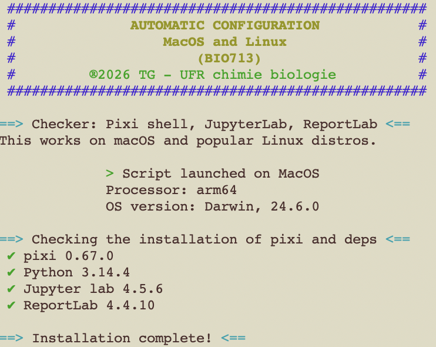
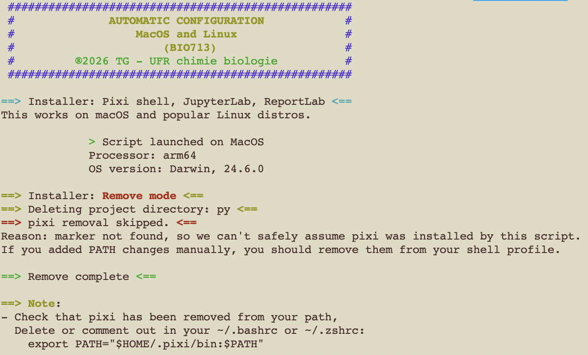

# BIO713 Setup

## Goal
These scripts install and check the required environment for the course [BIO713](https://formations.univ-grenoble-alpes.fr/fr/catalogue-2021/master-XB/master-biologie-IAQKB0GE/parcours-molecular-and-cellular-biology-1re-annee-IK43J2QV/ue-from-cells-to-viruses-molecular-genetics-and-epigenetics-controls-JGROOI24.html) "From Cells to Viruses: Molecular Genetics and Epigenetics Controls".

The course is proposed as part of the Master [Molecular and Cellular Biology](https://formations.univ-grenoble-alpes.fr/fr/catalogue-2021/master-XB/master-biologie-IAQKB0GE/parcours-molecular-and-cellular-biology-1re-annee-IK43J2QV.html) program.

These scripts are still in development and can behave abnormally.\
**They are provided "as is"**, without warranty as indicated in the [licence](LICENSE.md).\
Please use carefully.

## Usage

- Installation of the environment: To install the required modules, open your terminal (inside `Applications/Utilities` on MacOS) and type the following command. The script will create the folder hierarchy, install [pixi](https://pixi.prefix.dev/latest/advanced/pixi_shell/), [python](https://www.python.org/), [biopython](https://biopython.org/), [reportlab](https://docs.reportlab.com/) and [Jupyter Lab](https://jupyter.org/).

```
./Install.sh
```
- Your machine is set up !


- The activation and use of the environment will be explain during the class. In the meantime, you can check the validity of your installation by typing:

```
./Install.sh --check
```



A python script is also provided to check the correct environment in `Python` or in `Jupyter`:

```
python Check.py
```
- When one or more missing modules are detected:


- When all modules have been detected:


Alernatively, you can copy-paste the code into a Jupyter cell and run the cell.

## Prerequisites

The scripts should work on any computer running a modern OS (MacOS from Sequoia+, or Linux)
Unix users (MacOS and Linux) will need the terminal.app located in `Applications/Utilities` on MacOS systems (Adapt names if your OS is not running in US English language).

Another script for the `PowerShell` application on Windows machines is provided "as is". It had not been extensively tested so use with caution:

- Open PowerShell on your Windows machine and run the script or double-clik the script `Windows_Install.ps1`
- In case of installation failure, proceed with the manual install.

The activation and the manipulation of the environment will be discussed during the class.

## Desinstallation

- At the end of the course, you can remove the whole install by running again the bash script on MacOS and Linux:

```
./Install.sh --remove
```


- Windows users can revert by typing in the PowerShell:

```
.\Win_install.ps1 -Remove
```

The script will attempt to remove as much as possible:

- The complete folder hierarchy containing all the downloaded data (`~/Documents/BIO713` and enclosed directories).
- The module containing folder located in `~/Documents/BIO713/TP`.
- The `pixi` program should be removed only when it was installed by the `Install.sh` script.
- When `pixi` has been removed either programatically or manually, check that the path has also been cleaned by removing or commenting the line in your shell config file. Typically `~/.bashrc`, `~/.zshrc` or eventually `~/.config/fish/config.fish`. The file to look for is `export PATH="$HOME/.pixi/bin:$PATH"` or `fish_add_path $HOME/.pixi/bin`.

## Copyright

Thierry Gautier\
Université Grenoble Alpes\
2026
