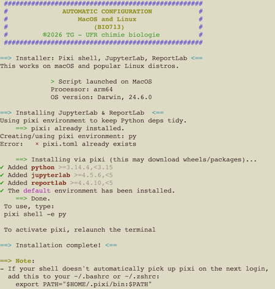
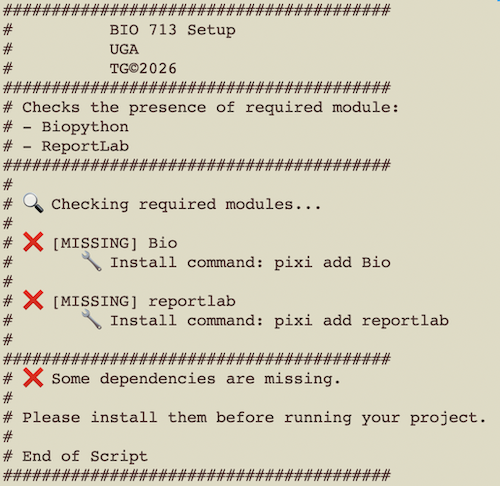
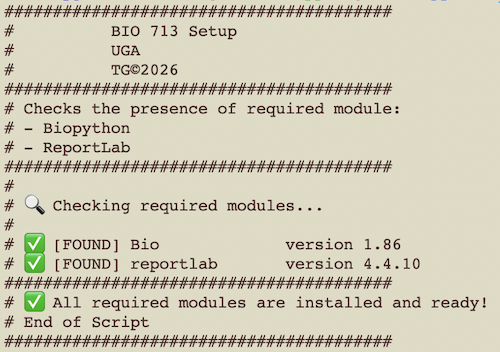

# Bio713 Setup

## Goal
These scripts check install the required environment and check for the presence of required Python modules for the course [BIO713](https://formations.univ-grenoble-alpes.fr/fr/catalogue-2021/master-XB/master-biologie-IAQKB0GE/parcours-molecular-and-cellular-biology-1re-annee-IK43J2QV/ue-from-cells-to-viruses-molecular-genetics-and-epigenetics-controls-JGROOI24.html) "From Cells to Viruses: Molecular Genetics and Epigenetics Controls".

The course is proposed as part of the Master [Molecular and Cellular Biology](https://formations.univ-grenoble-alpes.fr/fr/catalogue-2021/master-XB/master-biologie-IAQKB0GE/parcours-molecular-and-cellular-biology-1re-annee-IK43J2QV.html) program.

These scripts are still in development and can behave abnormally. They are provided "as is", without warranty as indicated in the [licence](LICENSE.md).\
Please use carefully.

## Usage

- Installation of the environment

```
./Install.sh
```

- Checking the presence of the required modules

```
python setup.py
```

## Prerequisites

The scripts should work on any computer running a modern OS (MacOS from Sequoia+, Linux or Windows 10+)
Unix users (MacOS and Linux) will need the terminal.app located in `Applications/Utilities` on MacOS systems (Adapt names if your OS is not running in US English language).

Use the PowerShell application on Windows machines.

## Script bash

- The script installs pixi and sets the directory hierarchy used in the practical. Then, the required python modules are install and insctructions are given to activate the jupyter environment.



## Script python

- When one or more missing modules are detected:



- When all modules have been detected:



## Copyright

Thierry Gautier\
Université Grenoble Alpes\
2026
