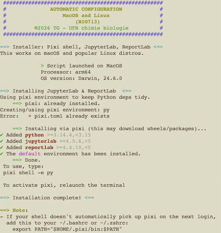
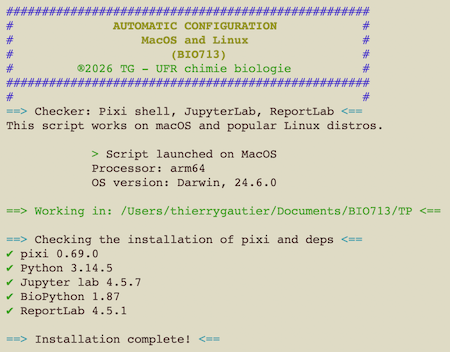
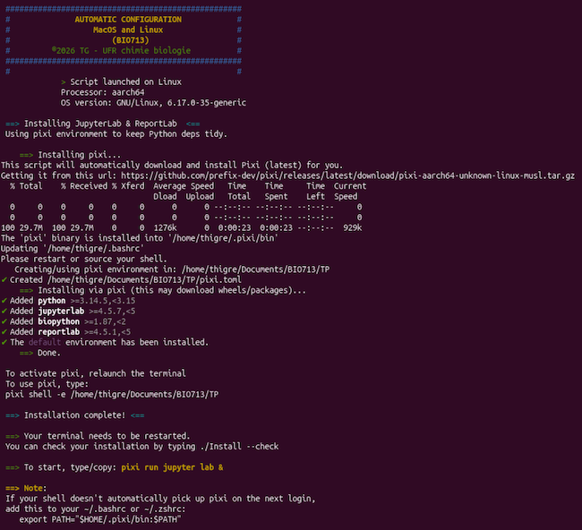
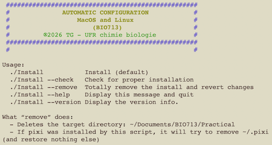
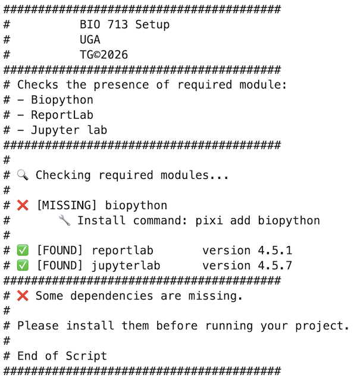
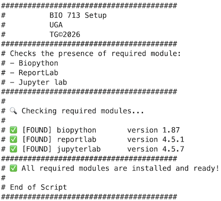
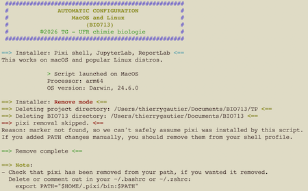

# BIO713 Setup

## 1. Goal
These scripts install and check the required environment for the course [BIO713](https://formations.univ-grenoble-alpes.fr/fr/catalogue-2021/master-XB/master-biologie-IAQKB0GE/parcours-molecular-and-cellular-biology-1re-annee-IK43J2QV/ue-from-cells-to-viruses-molecular-genetics-and-epigenetics-controls-JGROOI24.html) "From Cells to Viruses: Molecular Genetics and Epigenetics Controls".

The course is proposed as part of the Master [Molecular and Cellular Biology](https://formations.univ-grenoble-alpes.fr/fr/catalogue-2021/master-XB/master-biologie-IAQKB0GE/parcours-molecular-and-cellular-biology-1re-annee-IK43J2QV.html) program.

These scripts are still in development and can behave abnormally.\
**They are provided "as is"**, without warranty as indicated in the [licence](LICENSE.md).\
Please use carefully.

## 2. Usage

- Installation of the environment: To install the required modules, open your terminal (inside `Applications/Utilities` on MacOS) and type the following commands.
- The script will:
    - create the folder hierarchy
    - install [pixi](https://pixi.prefix.dev/latest/advanced/pixi_shell/), [python](https://www.python.org/), [biopython](https://biopython.org/), [reportlab](https://docs.reportlab.com/) and [Jupyter Lab](https://jupyter.org/).

```
git clone https://github.com/ThiGre38/BIO713_Install.git
cd BIO713_Install
./Install
```
- Your machine is set up !



- The activation and use of the environment will be explain during the class.
- In the meantime, you can check the validity of your installation by typing:

```
./Install --check
```


- Running the script on Linux Ubuntu should setup your machine automatically



## 3. Other options available

- To know what other options are available, run:

```
./Install --help
```



## 4. Checking your environment directly from python

- A python script is also provided to check the correct environment in `Python` or in `Jupyter lab`.
- This suppose that you already have a working python setup or that you successfully (re)installed python.

```
python Check.py
```
- When one or more missing modules are detected:



- When all modules have been detected:



- Alernatively, you can copy-paste the code into a Jupyter cell and run the cell.

## 5. Prerequisites

- The scripts should work on any computer running a modern OS (MacOS from Sequoia+, or Debian/Ubuntu Linux).
- Unix users (MacOS and Linux) will need the terminal.app located in `Applications/Utilities` on MacOS systems (Adapt names if your OS is not running in US English language).

- Another script for the `PowerShell` application on Windows machines is provided "as is". It has not been extensively tested, **so use with caution**:

- Open `PowerShell` on your Windows machine and run the script or double-click the script `Windows_Install.ps1`
- In case of an installation failure, proceed with the manual install instead (see the course Moodle page) or wait for the first practical session to sort out the installation issue(s).

- The activation and the manipulation of the environment will be discussed during the class.

## 6. Desinstallation

- At the end of the course, you can remove the whole install by running again the bash script on MacOS and Linux:

```
./Install --remove
```



- Windows users can revert by typing in the PowerShell:

```
.\Win_install.ps1 -Remove
```

- The script will attempt to remove as much as possible:

    1. The complete folder hierarchy containing all the downloaded data (`~/Documents/BIO713` and enclosed directories).
    2. The module containing folder located in `~/Documents/BIO713/TP`.
    3. The `pixi` program should be removed only when it was installed by the `Install` script.
    4. When `pixi` has been removed either programatically or manually, check that the path has also been cleaned by removing or commenting the line in your shell config file. Typically `~/.bashrc`, `~/.zshrc` or eventually `~/.config/fish/config.fish`.
        - The line to look for is `export PATH="$HOME/.pixi/bin:$PATH"` for bash and zsh or `fish_add_path $HOME/.pixi/bin` for fish shell.
- These 4 steps can also be performed by hand if the automatic procedure fails or if you prefer to realize the desinstallation manually.

## 7. Copyright

Thierry Gautier\
Université Grenoble Alpes\
2026
